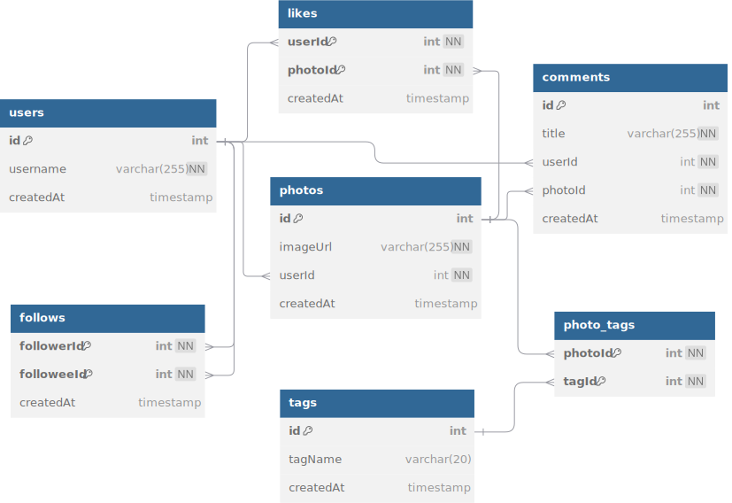

# Instagram Database Clone

**Here different logical queries will be added over three days time**

This repository contains the schema for a simplified clone of Instagram's database that I tried to create based on everything I've learned so far. The schema is designed to store users, photos, comments, likes, follows, and tags, with appropriate normalization and relationships between entities.

## Entity-Relationship (ER) Diagram



## Database Structure

### 1. Users Table
This table stores the details of users in the application.

- **id**: The primary key for the user.
- **username**: A unique username for each user.
- **createdAt**: The timestamp when the user was created.

```sql
CREATE TABLE users (
    id INT AUTO_INCREMENT PRIMARY KEY,
    username VARCHAR(255) UNIQUE NOT NULL,
    createdAt TIMESTAMP DEFAULT NOW()
);
```

### 2. Photos Table
This table stores photos uploaded by users.

- **id**: The primary key for the photo.
- **imageUrl**: The URL of the photo.
- **userId**: A foreign key that references the `users` table.
- **createdAt**: The timestamp when the photo was uploaded.

```sql
CREATE TABLE photos (
    id INT AUTO_INCREMENT PRIMARY KEY,
    imageUrl VARCHAR(255) NOT NULL,
    userId INT NOT NULL,
    FOREIGN KEY(userId) REFERENCES users(id),
    createdAt TIMESTAMP DEFAULT NOW()
);
```

### 3. Comments Table
This table stores comments made by users on photos.

- **id**: The primary key for the comment.
- **title**: The content of the comment.
- **userId**: A foreign key that references the `users` table.
- **photoId**: A foreign key that references the `photos` table.
- **createdAt**: The timestamp when the comment was made.

```sql
CREATE TABLE comments (
    id INT AUTO_INCREMENT PRIMARY KEY,
    title VARCHAR(255) NOT NULL,
    userId INT NOT NULL,
    FOREIGN KEY(userId) REFERENCES users(id),
    photoId INT NOT NULL,
    FOREIGN KEY(photoId) REFERENCES photos(id),
    createdAt TIMESTAMP DEFAULT NOW()
);
```

### 4. Likes Table
This table stores likes made by users on photos.

- **userId**: A foreign key that references the `users` table.
- **photoId**: A foreign key that references the `photos` table.
- **createdAt**: The timestamp when the like was made.
- The combination of `userId` and `photoId` forms the primary key, also known as **composite key**.

```sql
CREATE TABLE likes (
    userId INT NOT NULL,
    FOREIGN KEY(userId) REFERENCES users(id),
    photoId INT NOT NULL,
    FOREIGN KEY(photoId) REFERENCES photos(id),
    PRIMARY KEY(userId, photoId),
    createdAt TIMESTAMP DEFAULT NOW()
);
```

### 5. Follows Table
This table stores follow relationships between users.

- **followerId**: A foreign key that references the `users` table (the follower, ie. a person who is follows other).
- **followeeId**: A foreign key that references the `users` table (the followee, ie. a person who is followed by others).
- **createdAt**: The timestamp when the follow relationship was created.
- The combination of `followerId` and `followeeId` forms the primary key.

```sql
CREATE TABLE follows (
    followerId INT NOT NULL,
    FOREIGN KEY(followerId) REFERENCES users(id),
    followeeId INT NOT NULL,
    FOREIGN KEY(followeeId) REFERENCES users(id),
    PRIMARY KEY(followerId, followeeId),
    createdAt TIMESTAMP DEFAULT NOW()
);
```

### 6. Tags Table
This table stores unique tags that can be associated with photos.

- **id**: The primary key for the tag.
- **tagName**: A unique name for each tag.
- **createdAt**: The timestamp when the tag was created.

```sql
CREATE TABLE tags (
    id INT AUTO_INCREMENT PRIMARY KEY,
    tagName VARCHAR(20) UNIQUE,
    createdAt TIMESTAMP DEFAULT NOW()
);
```

### 7. Photo_Tags Table
This table stores the many-to-many relationship between photos and tags.

- **photoId**: A foreign key that references the `photos` table.
- **tagId**: A foreign key that references the `tags` table.
- The combination of `photoId` and `tagId` forms the primary key.

```sql
CREATE TABLE photo_tags (
    photoId INT NOT NULL,
    FOREIGN KEY(photoId) REFERENCES photos(id),
    tagId INT NOT NULL,
    FOREIGN KEY(tagId) REFERENCES tags(id),
    PRIMARY KEY(photoId, tagId)
);
```

## Database Normalization

Normalization is a database design technique that organizes tables to minimize redundancy and dependency. In this schema:

- The `tags` table has been normalized to eliminate redundancy. Each tag is stored only once, and the relationship between tags and photos is managed by the `photo_tags` table.
- The `photo_tags` table handles the many-to-many relationship between photos and tags.

### Example of Normalization

Consider a photo that has multiple tags:

- Without normalization, we might have a table(tags) where the same photo is stored multiple times, each with a different tagName. This would lead to redundancy.
- With normalization, we separate the tags into a different table and use a junction table (`photo_tags`) to link photos with their tags. This eliminates redundancy and ensures data consistency.

## Some Logical Queries
### Basic Queries
1. **Query 1:** What day of the week do most users register on?
   ```sql
   select
    count(*) as total,
    dayname(createdAt) as day
    from
        users
    group by
        day
    order by
        total desc
    limit
        1;
    ```
2. **Query 2:** Select the top 5 users that have been loyal for more than eight years and maybe reward them.
   ```sql
   select
    *
    from
        users
    where
        datediff(now(), createdAt) / 356 > 8
    order by
        createdAt desc
    limit
        5;
    ```
### Intermediate Queries
3. **Query 3:** Find the users who have never posted a photo and send them email to post some photos.
   ```sql
    select
        username
    from
        users
        left join photos on users.id = photos.userId
    where
        photos.id is null;
    ```
4. **Query 4:** Pick a most liked photo and send the user who posted that photo a reward.
   ```sql
    select
        username,
        photos.id,
        photos.imageUrl,
        count(*) as total
    from
        photos
        inner join likes on likes.photoId = photos.id
        inner join users on photos.userId = users.id
    group by
        photos.id
    order by
        total desc
    limit
        1;
    ```
5. **Query 5:** How many times does an average user posts?
     ```sql
    select
        ceil(
            (
                select
                    count(*)
                from
                    photos
            ) / (
                select
                    count(*)
                from
                    users
            )
        ) as average;
    ```
6. **Query 6:** What are the top 5 most commonly userd hashtags?
   ```sql
   select
        count(*) as total,
        tags.tagName
    from
        photo_tags
        join tags on photo_tags.tagId = tags.id
    group by
        tags.id
    order by
        total desc
    limit
        5;
    ```
7. **Query 7:** Find users who have likes every single photo on the app (*detect bots*)
   ```sql
    select
        username,
        likes.userId,
        count(*) as totalLikes
    from
        users
        inner join likes on users.id = likes.userId
    group by
        likes.userId
    having
        totalLikes = (
            select
                count(*)
            from
                photos
        );
    ```
8. **Query 8:** Retrieve all followers of a specific user
   ```sql
    SELECT
        u.username
    FROM
        follows f
        JOIN users u ON f.followerId = u.id
    WHERE
        f.followeeId = 1;
    ```
9.  **Query 9:** Show all the users that have liked a specific photo with id = 1
    ```sql
    SELECT
        users.username
    FROM
        likes
        JOIN users ON likes.userId = users.id
    WHERE
        likes.photoId = 1;
    ```
10. **Query 10:** Find users who have never uploaded a photo.
    ```sql
    SELECT
        username
    FROM
        users
    WHERE
        id NOT IN (
            SELECT
                userId
            FROM
                photos
        );
    ```
11. **Query 11:** Get a list of users who follow a specific user and have commented on one of their photos.
    ```sql
    SELECT
    DISTINCT u.username
    FROM
        follows f
        JOIN users u ON f.followerId = u.id
        JOIN comments c ON c.userId = u.id
    WHERE
        f.followeeId = 1
        AND c.photoId IN (
            SELECT
                id
            FROM
                photos
            WHERE
                userId = 1
        );
    ```
12. **Query 12:**